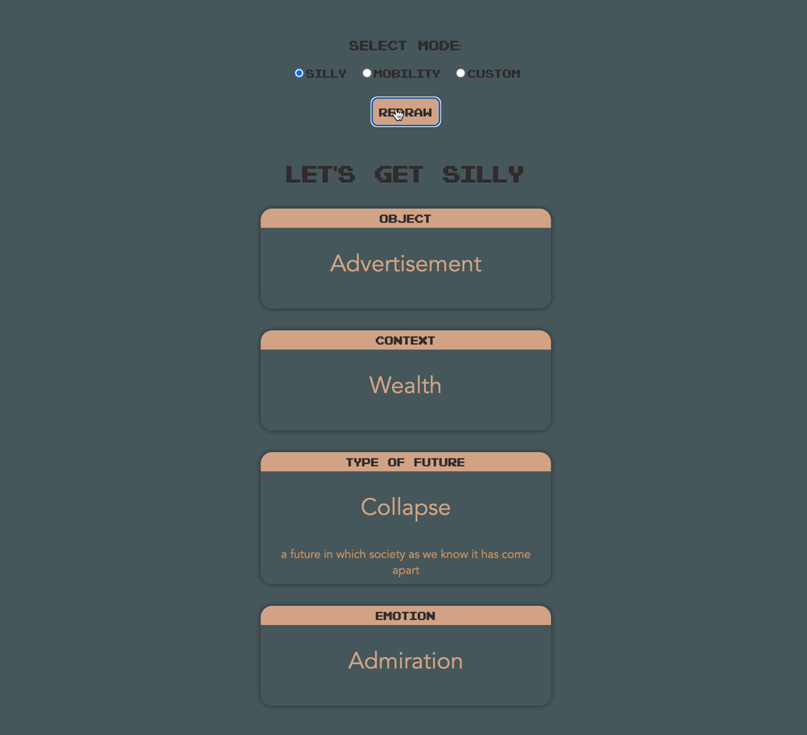
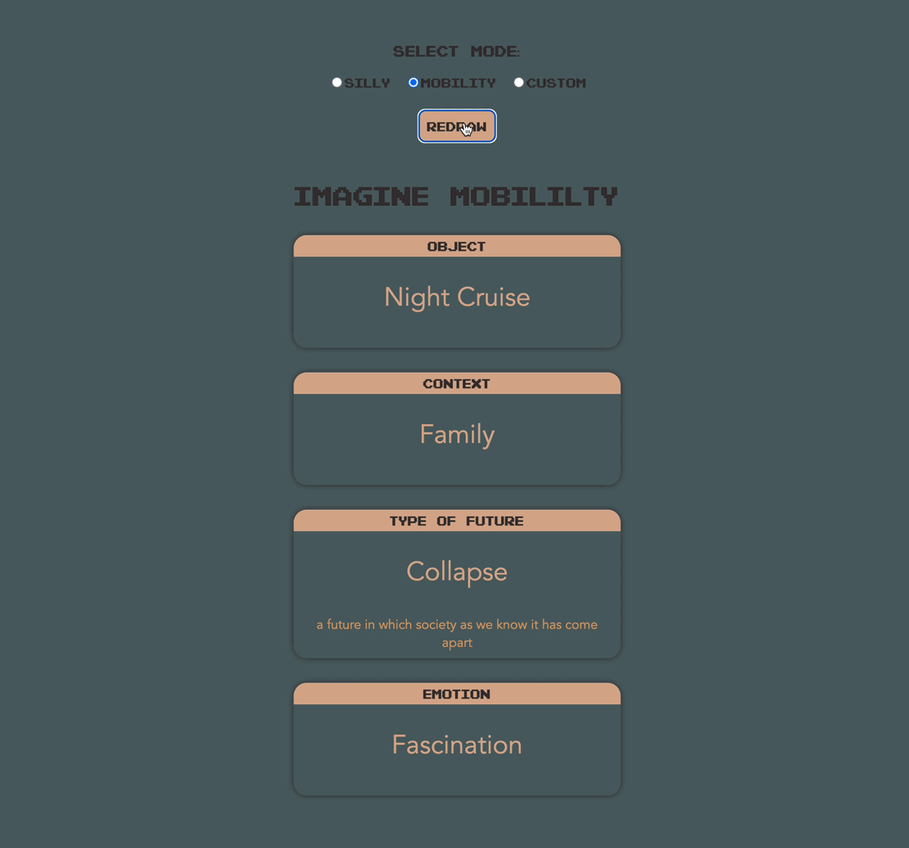
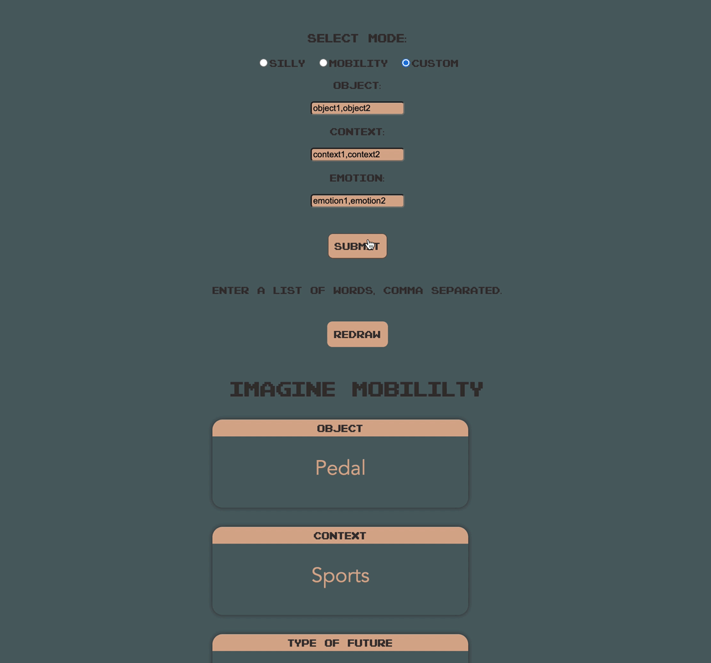

# ThingFromTheFuture
A game developed by Situation Lab for Speculative Design practice. Modified to have three different modes: general, mobility and a custom mode so you can upload your own words.

Please visit https://takinb.github.io/ThingFromTheFuture/ to have play!

# General mode 

# Mobility mode 

# Customised mode 

